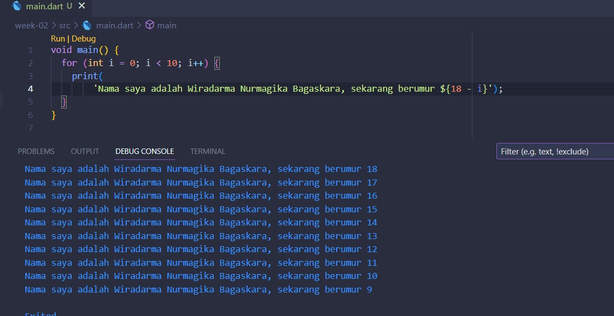

# Tugas Minggu 2, Mobile Programming

##### Nama : Wiradarma Nurmagika Bagaskara

##### NIM : 2141720184

##### Kelas : 3H

#### 1. Modifikasilah kode pada baris 3 di VS Code atau Editor Code favorit Anda berikut ini agar mendapatkan keluaran (output) sesuai yang diminta!

#### 2. Mengapa sangat penting untuk memahami bahasa pemrograman Dart sebelum kita menggunakan framework Flutter ? Jelaskan!

jawab : mengapa sangat pengting memahami dart terlebih dahulu, karena framework flutter menggunakan bahasa dart, sehingga dengan kita menguasai bahasa dart otomatis kita akan lebih mudah dalam mengembangkan aplikasi flutter. Selain itu, kita juga dapat memaksimalkan fitur-fitur yang dimiliki oleh dart, sehingga aplikasi flutter kita akan lebih clean code dan optimal. Contoh sederhananya adalah dart memiliki package dart:math dimana kita dapat menggunakan fungsi seperti max, min, dsb. Jika kita tidak mengetahui hal tersebut, maka kita akan membuang-buang waktu untuk membuat fungsi max, min secara manual. Disamping itu, dart juga memiliki fitur null safety dimana jika kita memahami dan dapat menggunakan fitur tersebut, akan dapat memudahkan kita dalam melakukan coding program, dan juga debugging. Hal tersebut juga dapat meminimalisir error yang akan terjadi ketika kita mengembangkan aplikasi flutter.

#### 3. Rangkumlah materi dari codelab ini menjadi poin-poin penting yang dapat Anda gunakan untuk membantu proses pengembangan aplikasi mobile menggunakan framework Flutter.

jawab :

- Fitur - fitur yang dimiliki bahasa dart
  1. productive tooling = tools untuk menganalisis kode
  2. Garbage Collection = untuk mengelola memori, sehingga memori yang digunakan akan lelbih efisien
  3. Type Annotations (optional) = untuk menjaga konsistensi semua data pada aplikasi
  4. Statically Typed = Dart menggunakan fitur type-safe dan type inference untuk menganalisis types saat runtime
  5. Portability = bahasa dart dapat digunakan untuk, web, desktop, maupun mobile
- Aritmatic Operators
  Dart sama dengan bahasa pemrograman lainnya, dimana memiliki fungsi (+) untuk penjumlahan, (-) untuk pengurangan, (\*) untuk perkalian, (/) untuk pembagian, (~/) untuk pembagian bilangan bulat, artinya hasil dari pembagian akan menghasilkan bilangan bulat, (%) untuk operasi modulus, dan yang terakhir (-expression) digunakan untuk menegasikan sebuah expression.
  Beberapa operator akan memiliki fungsi yang berbeda tergantung dengan tipe data variablenya, contohnya adalah operator (+) akan digunakan sebagai penjumlahan jika tipe data dari variable yang digunakan adalah num, namun akan menggaubungkan string jika tipe data variablenya adalah string.
- Increment and Decrement Operators
  ++var dan var++ digunakan untuk menambahkan nilai var sebanyak 1, perbedaannya hanya proses penambahannya, ++var ditambahkan terlebih dahulu kemudian digunakan, sedangkan var++ digunakan terlebih dahulu kemudian digunakan.
  --var dan var-- memiliki konsep yang sama seperti operasi increment diatas, namun decrement digunakan untuk mengurangi nilai var sebanyak 1.
- Equality and relational operators
  Digunakan untuk melakukan pengujian relasioanal diantara 2 variable, apakah kedua variable tersebut sama (==), apakah variable kiri lebih besar dibandingkan variable kanan (>), dan lain sebagainya (==, !=, >, <, >=, <=).
- Logical Operators
  Logical operators digunakan untuk menghasilkan boolean (true, false), dapat berupa variable, ekspresi, atau kondisi.
  !expression digunakan untuk menegasikan, misal !false = true
  || digunakan untuk menerapkan operasi logika OR
  && digunakan untuk menerapkan operasi logika AND
- Seperti kebanyakan bahasa modern, Dart menggunakan function dan method sebagai cara untuk memisahkan kode. Sebuah function atau method adalah potongan kode yang menerima beberapa data, eksekusi kode, dan kemudian mengembalikan beberapa data (return).

#### 4. Buatlah slide yang berisi penjelasan dan contoh eksekusi kode tentang perbedaan Null Safety dan Late variabel ! (Khusus soal ini kelompok berupa link google slide)

jawab : [ perbedaan Null Safety dan Late variabel ](https://docs.google.com/presentation/d/1jRhz3eOW5R-mHuINPZr1ffLaowfcjrLDH4i-amqR7yM/edit?usp=sharing)
