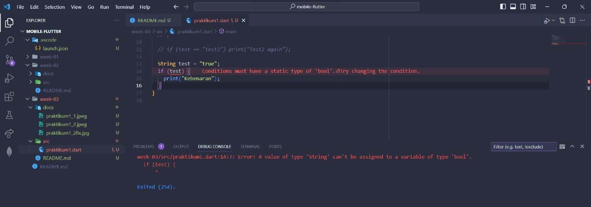

# Tugas Minggu 3, Mobile Programming

##### Nama : Wiradarma Nurmagika Bagaskara

##### NIM : 2141720184

##### Kelas : 3H

#### 1. Silakan selesaikan Praktikum 1 sampai 3, lalu dokumentasikan berupa screenshot hasil pekerjaan beserta penjelasannya!

##### Praktikum 1

- **langkah 1**
  Ketik atau salin kode program berikut ke dalam fungsi main().
  
- **langkah 2**
  
  Silakan coba eksekusi (Run) kode pada langkah 1 tersebut. Apa yang terjadi? Jelaskan!
  **Jawab:** muncul 2 text "Test2" dan "Test2 again", hal ini terjadi karena variabel **test** memiliki nilai "test2", dimana string tersebut memenuhi kondisi pada percabangan **else if(test == "test2")** yang mencetak "Test2" dan **if(test == "test2")** yang mencetak "Test2 again"
- **langkah 3**
  
  Apa yang terjadi ? Jika terjadi error, silakan perbaiki namun tetap menggunakan if/else.
  **Jawab:** Terjadi error disebakan oleh kondisi yang bertipe **string**, meskipun nilai dari string tersebut adalah true, namun nilai tersebut tetap dibaca sebagai **string**, sehingga akan menghasilkan error pada kondisi di **if**, karena di dalam kondisi harus berisi **bolean** / operator logika yang menghasilkan nilai **bolean**.
  
  Setelah tipe data dari variable **test** dirubah menjadi **boolean**, dan nilai dari variable tersebut dirubah menjadi **true**, maka tidak terjadi error lagi.

##### Praktikum 2

- **langkah 1**
  Ketik atau salin kode program berikut ke dalam fungsi main().
  
- **langkah 2**
  
  Silakan coba eksekusi (Run) kode pada langkah 1 tersebut. Apa yang terjadi? Jelaskan! Lalu perbaiki jika terjadi error.
  **Jawab:** Terjadi error yang disebabkan karena variable **counter** belum didefinisikan, sehingga muncul error **undefined**
  
  sudah tidak terjadi error, karena telah dideklarasikan dan diinisialisasikan variable **counter**nya.
- **langkah 3**
  Tambahkan kode program berikut, lalu coba eksekusi (Run) kode Anda.
  
  Apa yang terjadi ? Jika terjadi error, silakan perbaiki namun tetap menggunakan do-while.
  **Jawab:** Tidak terjadi error, karena variable **counter** telah dideklarasikan dan diinisialisasikan pada **langkah 2**

##### Praktikum 3
