# Tugas Minggu 4, Mobile Programming

##### Nama : Wiradarma Nurmagika Bagaskara

##### NIM : 2141720184

##### Kelas : 3H

#### 1. Silakan selesaikan Praktikum 1 sampai 5, lalu dokumentasikan berupa screenshot hasil pekerjaan Anda beserta penjelasannya!

##### Praktikum 1: Eksperimen Tipe Data List

- **langkah 1**
  Ketik atau salin kode program berikut ke dalam void main().
  
- **langkah 2**
  
  Silakan coba eksekusi (Run) kode pada langkah 1 tersebut. Apa yang terjadi? Jelaskan!
  **Jawab:** Program tidak terjadi error, dimana telah dideklarasi & diinisialisasikan sebuah list dengan length 3, kemudian list dengan index-1 dirubah nilainya menjadi 1. Seluruh **assert** yang ada pada kode program terlewati karena sesuai dengan nilai yang ada pada variable list.
- **langkah 3**
  
  Ubah kode pada langkah 1 menjadi variabel final yang mempunyai index = 5 dengan default value = null. Isilah nama dan NIM Anda pada elemen index ke-1 dan ke-2. Lalu print dan capture hasilnya.

  Apa yang terjadi ? Jika terjadi error, silakan perbaiki.

  **Jawab:** Terjadi error ketika akan melakukan perubahan nilai pada index ke 1 dan ke 2, dimana muncul error yang berbunyi "A value type String can't be assigned to a variable of type Null", yang artinya variable bertipe String tidak bisa dimasukkan ke variable bertipe Null. Hal ini terjadi karena kita telah mengisi variable list yang memiliki panjang 6 dengan nilai **null** semua, sehingga program akan menginisialisasikan generic type dari variable list adalah **Null**, sehingga kita tidak dapat memasukkan nilai String.
  
  Untuk mengatasi hal tersebut, maka kita harus mendefinisikan generic type dari variable list menjadi **dynamic** agar dapat diisi oleh berbagai tipe data.

##### Praktikum 2: Eksperimen Tipe Data Set

- **langkah 1**
  Ketik atau salin kode program berikut ke dalam fungsi main().
  
- **langkah 2**
  
  Silakan coba eksekusi (Run) kode pada langkah 1 tersebut. Apa yang terjadi? Jelaskan! Lalu perbaiki jika terjadi error.
  **Jawab:** Tidak terjadi error, karena program hanya mendeklarasi & menginisialisasikan sebuah **Set** yang kemudian di print.
- **langkah 3**
  Tambahkan kode program berikut, lalu coba eksekusi (Run) kode Anda.
  
  Apa yang terjadi ? Jika terjadi error, silakan perbaiki namun tetap menggunakan ketiga variabel tersebut. Tambahkan elemen nama dan NIM Anda pada kedua variabel Set tersebut dengan dua fungsi berbeda yaitu .add() dan .addAll(). Untuk variabel Map dihapus, nanti kita coba di praktikum selanjutnya.
  **Jawab:** Tidak terjadi error, karena 2 variable **Set** dan 1 variable **Map** masih kosong.
  
  Pada **Set** names1, saya gunakan penambahan elemen meggunakan **add**, sedangkan pada **Set** names2 saya gunakan penambahan elemen menggunakan **addAll**.

##### Praktikum 3: Eksperimen Tipe Data Maps

- **langkah 1**
  Ketik atau salin kode program berikut ke dalam fungsi main().
  
- **langkah 2**
  
  Silakan coba eksekusi (Run) kode pada langkah 1 tersebut. Apa yang terjadi? Jelaskan! Lalu perbaiki jika terjadi error.
  **Jawab:** Tidak terjadi error, program melakukan deklarasi dan inisialisasi variable gifts dan nobleGases dengan tipe data **Map**, perbedaan dari kedua variable tersebut hanya terletak pada tipe data key-nya, dimana pada variable gifts, key bertipe data **String** sedangkan pada variable nobleGases, key bertipe data **int**.
- **langkah 3**
  Tambahkan kode program berikut, lalu coba eksekusi (Run) kode Anda.
  
  Apa yang terjadi ? Jika terjadi error, silakan perbaiki.
  
  Tambahkan elemen nama dan NIM Anda pada tiap variabel di atas (gifts, nobleGases, mhs1, dan mhs2). Dokumentasikan hasilnya dan buat laporannya!
  **Jawab:** Tidak terjadi error, setelah program melakukan deklarasi dan inisialisasi variable gifts dan nobleGases, program juga melakukan perubahan value pada kedua variable tersebut, dengan cara **namaVariable[key] = value**, kemudian ketika diprint, maka nilai terbaru yang akan muncul.
  

##### Praktikum 4: Eksperimen Tipe Data List: Spread dan Control-flow Operators

- **langkah 1**
  Ketik atau salin kode program berikut ke dalam fungsi main().
  
- **langkah 2**
  
  Silakan coba eksekusi (Run) kode pada langkah 1 tersebut. Apa yang terjadi? Jelaskan! Lalu perbaiki jika terjadi error.
  **Jawab:** Terjadi error, karena salah penulisan variable. Program tersebut melakukan penggabungan 2 list menggunakan spread operator, dimana list1 dimasukkan kedalam list2.
- **langkah 3**
  Tambahkan kode program berikut, lalu coba eksekusi (Run) kode Anda.
  
  Apa yang terjadi ? Jika terjadi error, silakan perbaiki.
  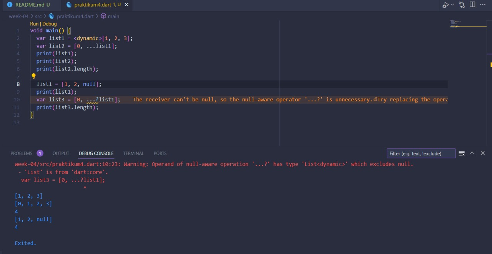
  Tambahkan variabel list berisi NIM Anda menggunakan Spread Operators. Dokumentasikan hasilnya dan buat laporannya!
  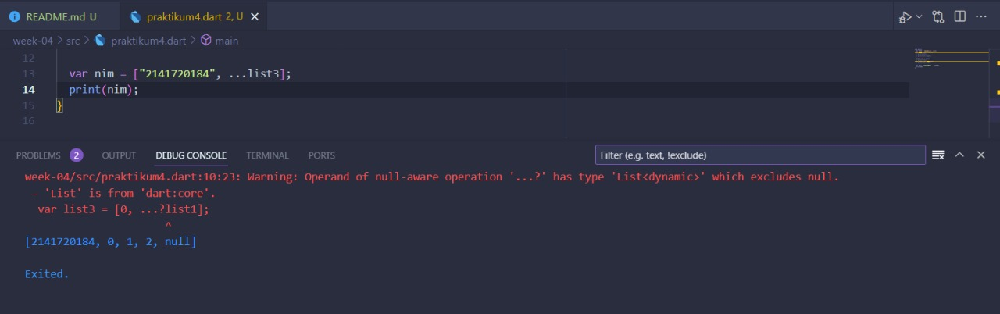
  **Jawab:** Terjadi error, karena list1 awalnya diisi angka, sehingga mendefinisikan generic typenya menjadi int, sehingga ketika salah satu nilainya dirubah menjadi **null** maka akan muncul error.

- **langkah 4**
  Tambahkan kode program berikut, lalu coba eksekusi (Run) kode Anda.
  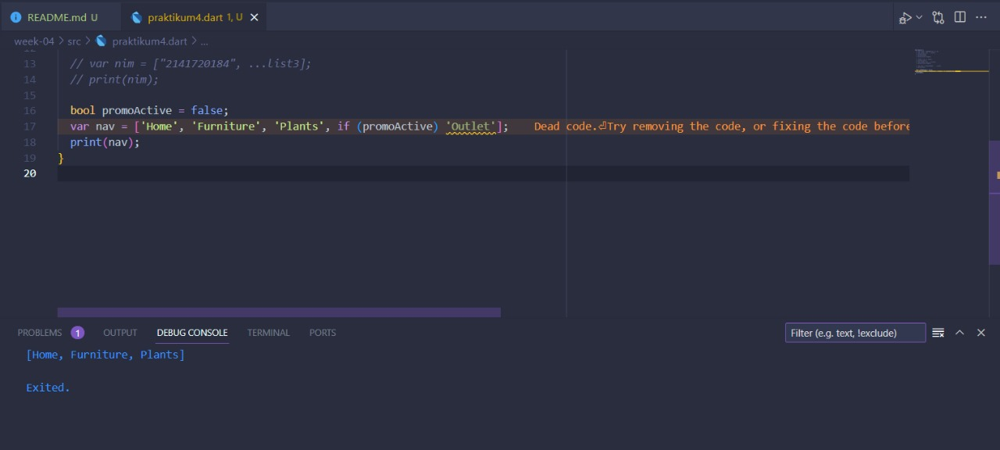
  Apa yang terjadi ? Jika terjadi error, silakan perbaiki. Tunjukkan hasilnya jika variabel promoActive ketika true dan false.
  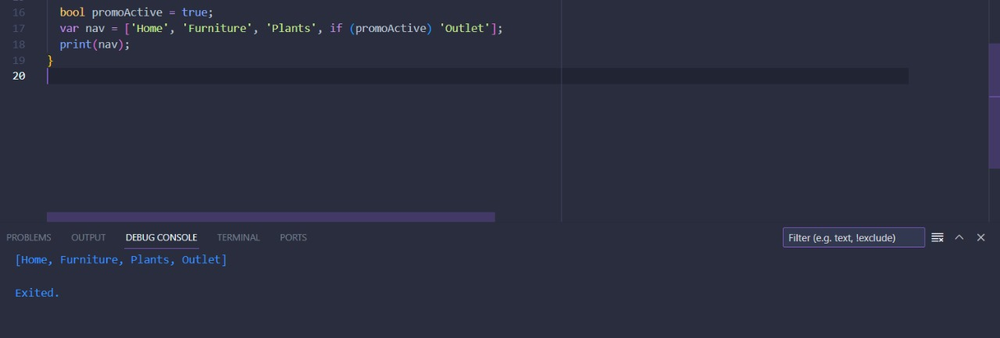
  **Jawab:** Jika promoActive bernilai false, maka Outlet tidak ditampilkan. Sebaliknya jika bernilai true, maka akan ditampilkan.
- **langkah 5**
  Tambahkan kode program berikut, lalu coba eksekusi (Run) kode Anda.
  
  Apa yang terjadi ? Jika terjadi error, silakan perbaiki. Tunjukkan hasilnya jika variabel login mempunyai kondisi lain.
  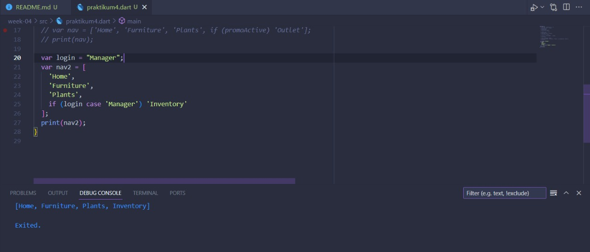
  **Jawab:** Jika login sebagai kasir, maka Inventory tidak muncul, namun jika login sebagai manager, maka Inventory akan muncul.
- **langkah 6**
  Tambahkan kode program berikut, lalu coba eksekusi (Run) kode Anda.
  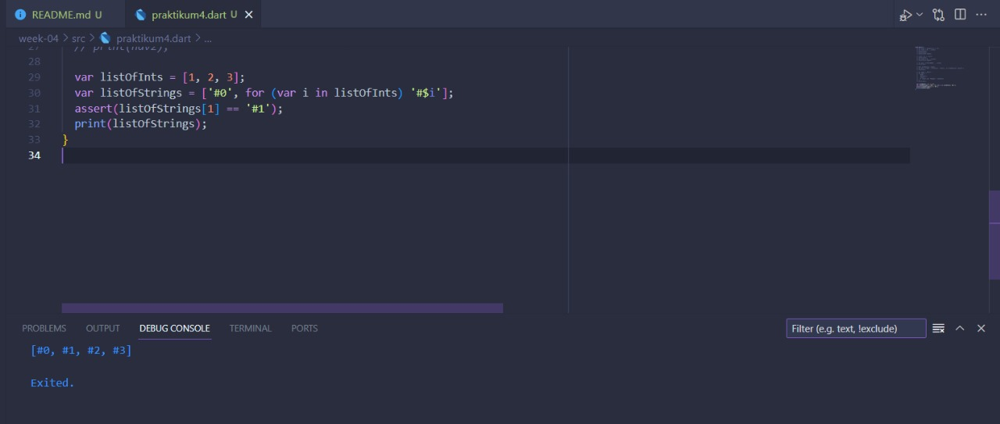
  Apa yang terjadi ? Jika terjadi error, silakan perbaiki. Jelaskan manfaat Collection For dan dokumentasikan hasilnya.
  **Jawab:** Tidak terjadi error, manfaat dari Collection for jika kita ingin memasukkan list nilai ke sebuah variable list, namun ingin memodifikasi nilai tersebut.

##### Praktikum 5: Eksperimen Tipe Data Records

- **langkah 1**
  Ketik atau salin kode program berikut ke dalam fungsi main().
  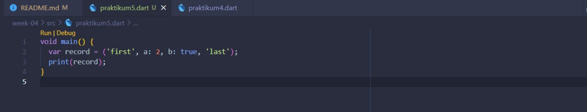
- **langkah 2**
  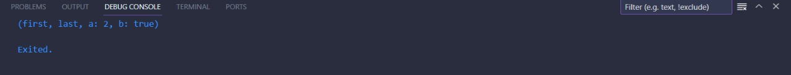
  Silakan coba eksekusi (Run) kode pada langkah 1 tersebut. Apa yang terjadi? Jelaskan! Lalu perbaiki jika terjadi error.
  **Jawab:** Tidak terjadi error, kode program diatas mendeklarasikan dan menginisialisasikan variable reacord, kemudian di print
- **langkah 3**
  Tambahkan kode program berikut di luar scope void main(), lalu coba eksekusi (Run) kode Anda.
  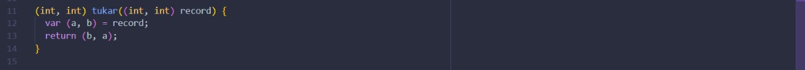
  Apa yang terjadi ? Jika terjadi error, silakan perbaiki. Gunakan fungsi tukar() di dalam main() sehingga tampak jelas proses pertukaran value field di dalam Records.
  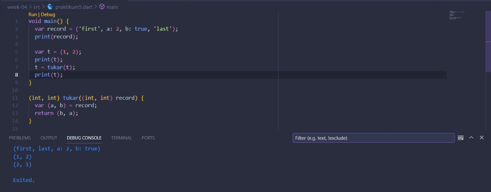
  **Jawab:** disini saya membuat variable **t** dengan nilai (1, 2), kemudian setelah dimasukkan ke function tukar, maka nilai akan berubah menjadi (2,1)
- **langkah 4**
  Tambahkan kode program berikut di dalam scope void main(), lalu coba eksekusi (Run) kode Anda.
  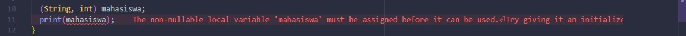
  Apa yang terjadi ? Jika terjadi error, silakan perbaiki. Inisialisasi field nama dan NIM Anda pada variabel record mahasiswa di atas. Dokumentasikan hasilnya dan buat laporannya!
  **Jawab:** Terdapat error, yang disebabkan oleh record mahasiswa yang tidak memiliki default value, sehingga ketika di print akan muncul error.
  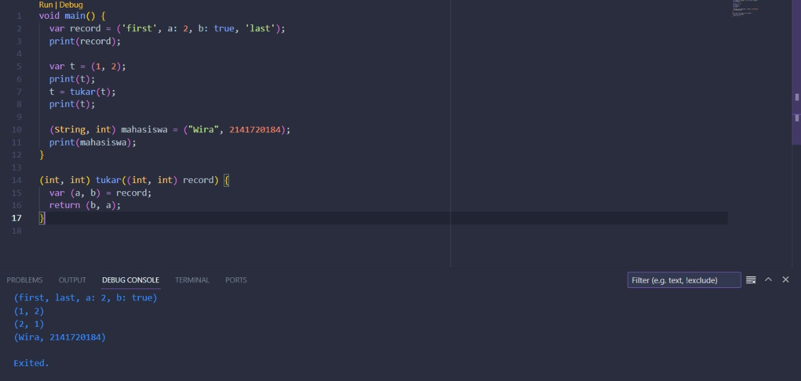
- **langkah 5**
  Tambahkan kode program berikut di dalam scope void main(), lalu coba eksekusi (Run) kode Anda.
  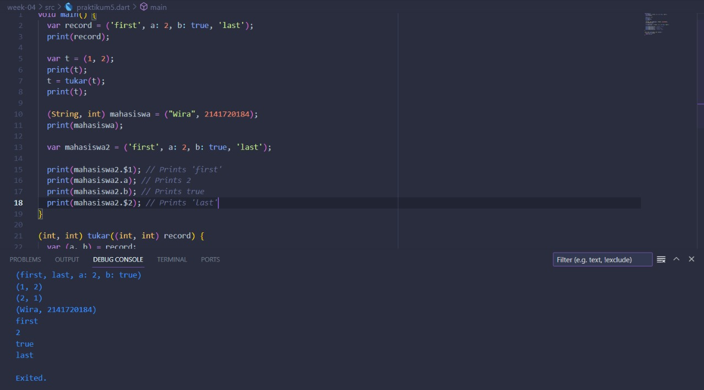
  Apa yang terjadi ? Jika terjadi error, silakan perbaiki. Gantilah salah satu isi record dengan nama dan NIM Anda, lalu dokumentasikan hasilnya dan buat laporannya!
  **Jawab:** Tidak terdapat error, untuk mengakses record dapat menggunakan undex dengan memanggil $-index (dimulai dari angka 1), atau dengan memanggil key.
  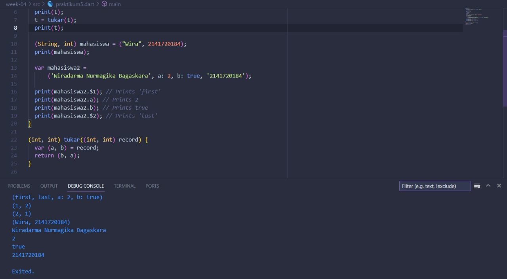

#### 2. Jelaskan yang dimaksud Functions dalam bahasa Dart!

**Jawab:** Sama seperti function yang ada pada bahasa pemrograman lainnya. Function merupakan sebuah blok program yang digunakan untuk melakukan sebuah pekerjaan tertentu ketika dipanggil. Function digunakan agar kode program lebih terorganisir dan menghindari redundant pada kode program.

#### 3. Jelaskan jenis-jenis parameter di Functions beserta contoh sintaksnya!

**Jawab:**

- Named Parameter
  Named parameter adalah sebuah parameter yang memiliki nama, sehingga ketika function tersebut dipanggil, urutan parameter tidak harus berurutan, namun diisi sesuai key yang sudah ditetapkan.
  contoh syntax:
  cetakPesan({String nama, String pesan})

  cetakPesan(nama: "Wira", pesan: "Selamat pagi")

- Optional Parameter
  Optional parameter adalah sebuah parameter yang opsional (dapat diisi / dikosongi).
  contoh syntax:
  String kirimPesan(String pengirim, String pesan, [String? media])
  {
  var result = pengirim + ' berpesan ' + pesan;
  if (media != null) {
  result = result + ' menggunakan media ' + media;
  }
  return result;
  }

  print(kirimPesan("Wira", "Selamat pagi"))
  print(kirimPesan("Wira", "Selamat pagi", "telepon"))

#### 4. Jelaskan maksud Functions sebagai first-class objects beserta contoh sintaknya!

**Jawab:** Function dapat digunakan sebagai variable, parameter dari function lain, dan fungsi juga dapat mengembalikan fungsi lain.
Contoh syntax:
var cetakpesan = (msg) => print(msg);

---

int tambah(int a, int b) {
return a + b;
}

int kalkulasi(int Function(int, int) operasi, int a, int b) {
return operasi(a, b);
}

var hasilPenjumlahan = kalkulasi(tambah, 5, 3);

#### 5. Apa itu Anonymous Functions? Jelaskan dan berikan contohnya!

**Jawab:** Anonymous function merupakan function yang tidak memiliki nama.
Contoh syntax:
var list = [1,2,3];
list.forEach((e) => print(e));

(e) => print(e) = merupakan anonymous function.

#### 6. Jelaskan perbedaan Lexical scope dan Lexical closures! Berikan contohnya!

**Jawab:**
**Lexical scope** merupakan sebuah scope yang bersarang / nested, inner function dapat mengakses variable yang dimiliki oleh parent functionnya
Contoh syntax:

void main() {
var nama = "Wiradarma";

void cetak() {
print("selamat datang, $nama");
}
}

**Lexical closures** adalah fungsi yang memiliki akses ke variabel dalam cakupan leksikalnya, meskipun fungsi tersebut digunakan di luar cakupan aslinya.

Contoh syntax:

#### 7. Jelaskan dengan contoh cara membuat return multiple value di Functions!

**Jawab:** Return multiple value akan mengembalikan data bertipe record.
Contoh syntax:
(String, String) getProfile() {
return ("Wira", "2141720184");
}

var nama, nim = getProfile()
