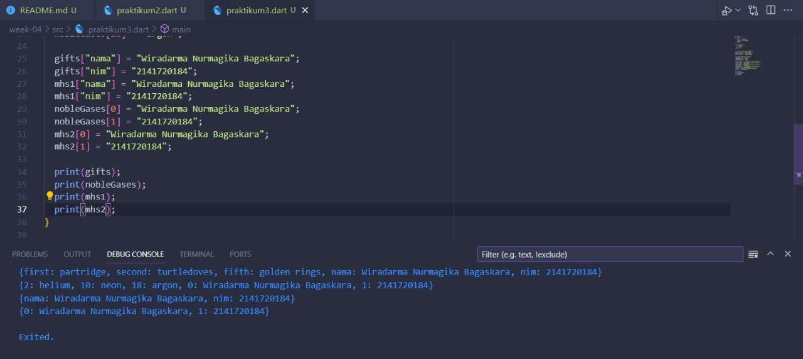

# Tugas Minggu 4, Mobile Programming

##### Nama : Wiradarma Nurmagika Bagaskara

##### NIM : 2141720184

##### Kelas : 3H

#### 1. Silakan selesaikan Praktikum 1 sampai 5, lalu dokumentasikan berupa screenshot hasil pekerjaan Anda beserta penjelasannya!

##### Praktikum 1: Eksperimen Tipe Data List

- **langkah 1**
  Ketik atau salin kode program berikut ke dalam void main().
  
- **langkah 2**
  
  Silakan coba eksekusi (Run) kode pada langkah 1 tersebut. Apa yang terjadi? Jelaskan!
  **Jawab:** Program tidak terjadi error, dimana telah dideklarasi & diinisialisasikan sebuah list dengan length 3, kemudian list dengan index-1 dirubah nilainya menjadi 1. Seluruh **assert** yang ada pada kode program terlewati karena sesuai dengan nilai yang ada pada variable list.
- **langkah 3**
  
  Ubah kode pada langkah 1 menjadi variabel final yang mempunyai index = 5 dengan default value = null. Isilah nama dan NIM Anda pada elemen index ke-1 dan ke-2. Lalu print dan capture hasilnya.

  Apa yang terjadi ? Jika terjadi error, silakan perbaiki.

  **Jawab:** Terjadi error ketika akan melakukan perubahan nilai pada index ke 1 dan ke 2, dimana muncul error yang berbunyi "A value type String can't be assigned to a variable of type Null", yang artinya variable bertipe String tidak bisa dimasukkan ke variable bertipe Null. Hal ini terjadi karena kita telah mengisi variable list yang memiliki panjang 6 dengan nilai **null** semua, sehingga program akan menginisialisasikan generic type dari variable list adalah **Null**, sehingga kita tidak dapat memasukkan nilai String.
  
  Untuk mengatasi hal tersebut, maka kita harus mendefinisikan generic type dari variable list menjadi **dynamic** agar dapat diisi oleh berbagai tipe data.

##### Praktikum 2: Eksperimen Tipe Data Set

- **langkah 1**
  Ketik atau salin kode program berikut ke dalam fungsi main().
  
- **langkah 2**
  
  Silakan coba eksekusi (Run) kode pada langkah 1 tersebut. Apa yang terjadi? Jelaskan! Lalu perbaiki jika terjadi error.
  **Jawab:** Tidak terjadi error, karena program hanya mendeklarasi & menginisialisasikan sebuah **Set** yang kemudian di print.
- **langkah 3**
  Tambahkan kode program berikut, lalu coba eksekusi (Run) kode Anda.
  
  Apa yang terjadi ? Jika terjadi error, silakan perbaiki namun tetap menggunakan ketiga variabel tersebut. Tambahkan elemen nama dan NIM Anda pada kedua variabel Set tersebut dengan dua fungsi berbeda yaitu .add() dan .addAll(). Untuk variabel Map dihapus, nanti kita coba di praktikum selanjutnya.
  **Jawab:** Tidak terjadi error, karena 2 variable **Set** dan 1 variable **Map** masih kosong.
  
  Pada **Set** names1, saya gunakan penambahan elemen meggunakan **add**, sedangkan pada **Set** names2 saya gunakan penambahan elemen menggunakan **addAll**.

##### Praktikum 3: Eksperimen Tipe Data Maps

- **langkah 1**
  Ketik atau salin kode program berikut ke dalam fungsi main().
  
- **langkah 2**
  
  Silakan coba eksekusi (Run) kode pada langkah 1 tersebut. Apa yang terjadi? Jelaskan! Lalu perbaiki jika terjadi error.
  **Jawab:** Tidak terjadi error, program melakukan deklarasi dan inisialisasi variable gifts dan nobleGases dengan tipe data **Map**, perbedaan dari kedua variable tersebut hanya terletak pada tipe data key-nya, dimana pada variable gifts, key bertipe data **String** sedangkan pada variable nobleGases, key bertipe data **int**.
- **langkah 3**
  Tambahkan kode program berikut, lalu coba eksekusi (Run) kode Anda.
  
  Apa yang terjadi ? Jika terjadi error, silakan perbaiki.
  
  Tambahkan elemen nama dan NIM Anda pada tiap variabel di atas (gifts, nobleGases, mhs1, dan mhs2). Dokumentasikan hasilnya dan buat laporannya!
  **Jawab:** Tidak terjadi error, setelah program melakukan deklarasi dan inisialisasi variable gifts dan nobleGases, program juga melakukan perubahan value pada kedua variable tersebut, dengan cara **namaVariable[key] = value**, kemudian ketika diprint, maka nilai terbaru yang akan muncul.
  

##### Praktikum 4: Eksperimen Tipe Data List: Spread dan Control-flow Operators

- **langkah 1**
  Ketik atau salin kode program berikut ke dalam fungsi main().
  
- **langkah 2**
  
  Silakan coba eksekusi (Run) kode pada langkah 1 tersebut. Apa yang terjadi? Jelaskan! Lalu perbaiki jika terjadi error.
  **Jawab:** Terjadi error, karena salah penulisan variable. Program tersebut melakukan penggabungan 2 list menggunakan spread operator, dimana list1 dimasukkan kedalam list2.
- **langkah 3**
  Tambahkan kode program berikut, lalu coba eksekusi (Run) kode Anda.
  
  Apa yang terjadi ? Jika terjadi error, silakan perbaiki.
  
  Tambahkan variabel list berisi NIM Anda menggunakan Spread Operators. Dokumentasikan hasilnya dan buat laporannya!
  **Jawab:**
- **langkah 4**
  Tambahkan kode program berikut, lalu coba eksekusi (Run) kode Anda.
  
  Apa yang terjadi ? Jika terjadi error, silakan perbaiki. Tunjukkan hasilnya jika variabel promoActive ketika true dan false.
  **Jawab:**
- **langkah 5**
  Tambahkan kode program berikut, lalu coba eksekusi (Run) kode Anda.
  
  Apa yang terjadi ? Jika terjadi error, silakan perbaiki. Tunjukkan hasilnya jika variabel login mempunyai kondisi lain.
  **Jawab:**
- **langkah 6**
  Tambahkan kode program berikut, lalu coba eksekusi (Run) kode Anda.
  
  Apa yang terjadi ? Jika terjadi error, silakan perbaiki. Jelaskan manfaat Collection For dan dokumentasikan hasilnya.
  **Jawab:**

#### 2. Buatlah sebuah program yang dapat menampilkan bilangan prima dari angka 0 sampai 201 menggunakan Dart. Ketika bilangan prima ditemukan, maka tampilkan nama lengkap dan NIM Anda.

Disini saya menggunakan algoritma **Sieve of Eratosthenes** untuk mencari bilangan primary.

##### Hasil

