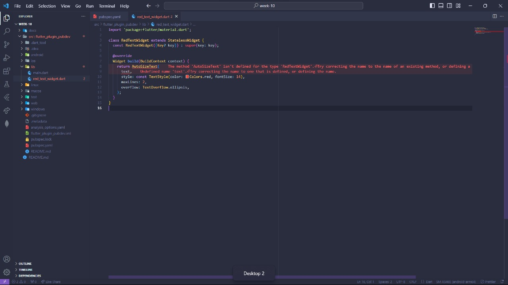

# Tugas Minggu 10, Mobile Programming

##### Nama : Wiradarma Nurmagika Bagaskara

##### NIM : 2141720184

##### Kelas : 3H

##### Praktikum Menerapkan Plugin di Project Flutter

- **Langkah 1: Buat Project Baru**
  Buatlah sebuah project flutter baru dengan nama flutter_plugin_pubdev. Lalu jadikan repository di GitHub Anda dengan nama flutter_plugin_pubdev.
  
- **Langkah 2: Menambahkan Plugin**
  Tambahkan plugin auto_size_text menggunakan perintah berikut di terminal
  
- **Langkah 3: Buat file red_text_widget.dart**
  Buat file baru bernama red_text_widget.dart di dalam folder lib lalu isi kode seperti berikut.
  
- **Langkah 4: Tambah Widget AutoSizeText**
  Masih di file red_text_widget.dart, untuk menggunakan plugin auto_size_text, ubahlah kode return Container() menjadi seperti berikut.
  
  Setelah Anda menambahkan kode di atas, Anda akan mendapatkan info error. Mengapa demikian? Jelaskan dalam laporan praktikum Anda!
  Jawab:
  Terdapat 2 error, yang pertama kita harus import plugin AutoSizeText terlebih dahulu, yang kedua tidak adanya variable **text** sehingga terjadi error.
- **Langkah 5: Langkah 5: Buat Variabel text dan parameter di constructor**
  Tambahkan variabel text dan parameter di constructor seperti berikut.
  
- **Langkah 6: Tambahkan widget di main.dart**
  Buka file main.dart lalu tambahkan di dalam children: pada class \_MyHomePageState
  

  
