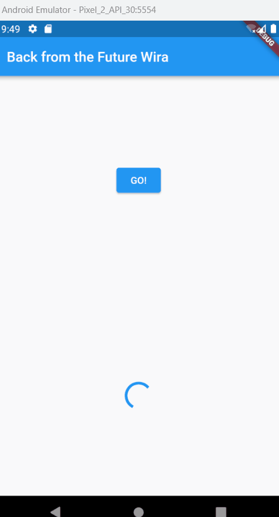
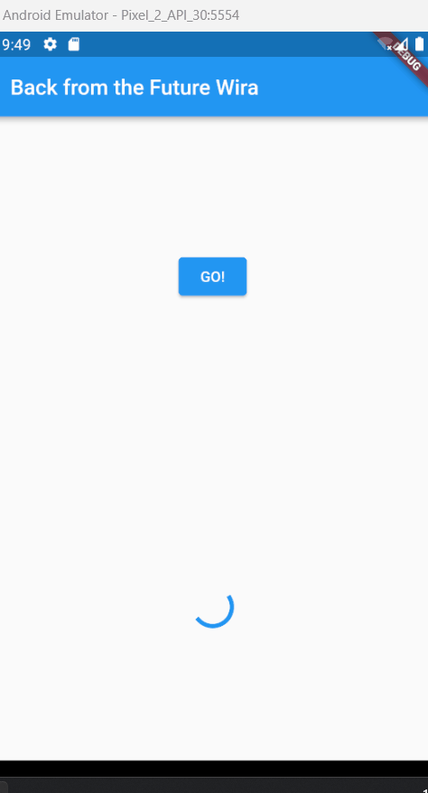
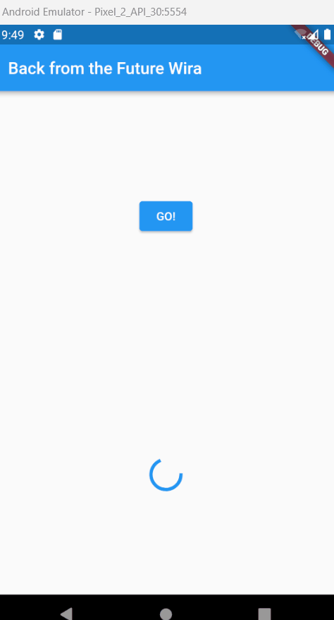
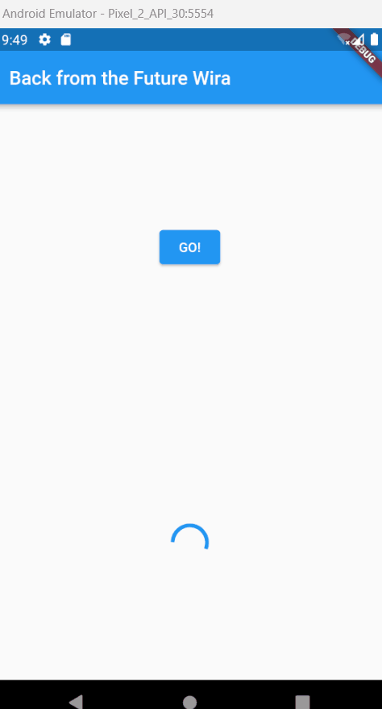
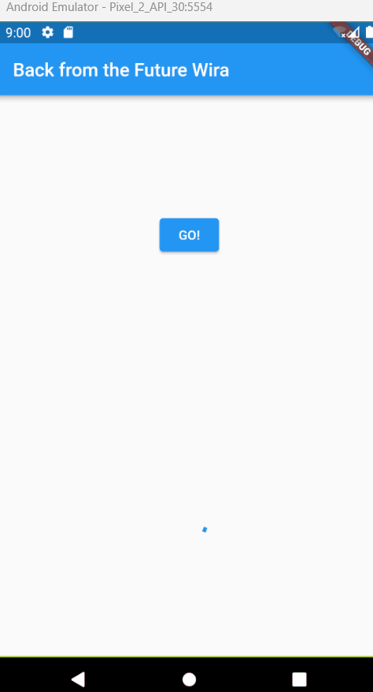
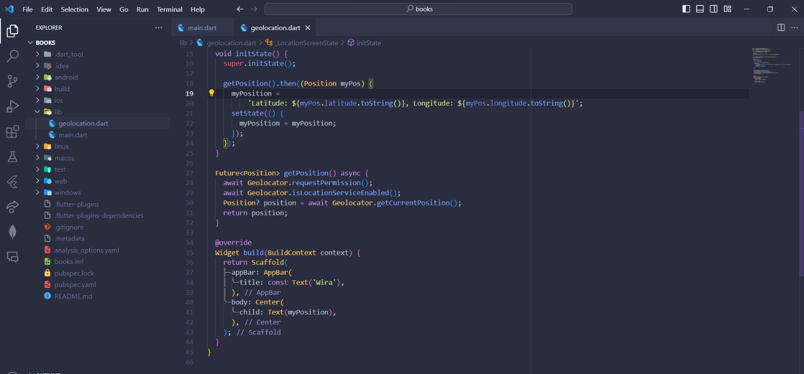
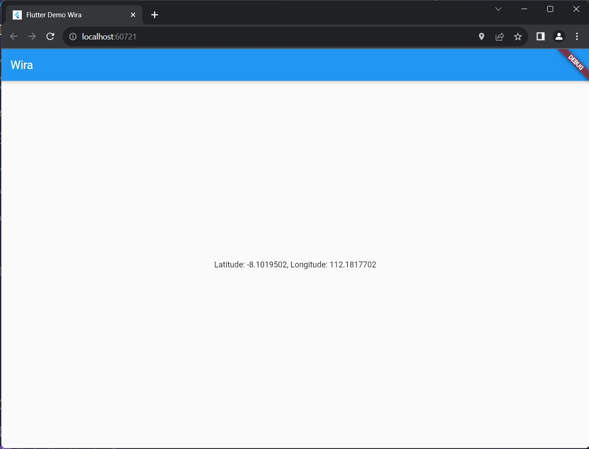
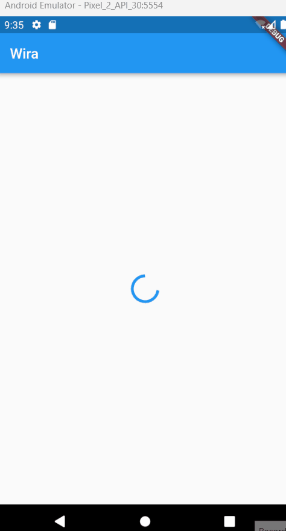
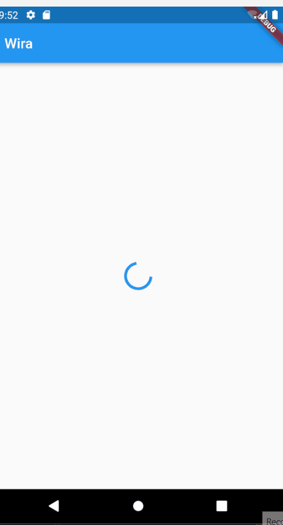

# Praktikum 1: Mengunduh Data dari Web Service (API)

### Langkah 1: Buat Project Baru

Buatlah sebuah project flutter baru dengan nama books di folder src week-12 repository GitHub Anda.

Kemudian Tambahkan dependensi http dengan mengetik perintah berikut di terminal.

### Langkah 2: Cek file pubspec.yaml

Jika berhasil install plugin, pastikan plugin http telah ada di file pubspec ini seperti berikut.

### Langkah 3: Buka file main.dart

### Soal 1

Tambahkan nama panggilan Anda pada title app sebagai identitas hasil pekerjaan Anda.

### Langkah 4: Tambah method getData()

Tambahkan method ini ke dalam class \_FuturePageState yang berguna untuk mengambil data dari API Google Books.

### Soal 2

- Carilah judul buku favorit Anda di Google Books, lalu ganti ID buku pada variabel path di kode tersebut. Caranya ambil di URL browser Anda seperti gambar berikut ini.

- Kemudian cobalah akses di browser URI tersebut dengan lengkap seperti ini. Jika menampilkan data JSON, maka Anda telah berhasil. Lakukan capture milik Anda dan tulis di README pada laporan praktikum. Lalu lakukan commit dengan pesan "W12: Soal 2".

### Langkah 5: Tambah kode di ElevatedButton

Tambahkan kode pada onPressed di ElevatedButton seperti berikut.

### Soal 3

- Jelaskan maksud kode langkah 5 tersebut terkait substring dan catchError!
  Jawab: Hasil fetch data dari googleapis yang berupa json diubah menjadi string dengan memanggil fungsi toString(), kemudian digunakan fungsi substtring untuk memotong string hasil fetch data. CatchError digunakan untuk menangani error ketika fetch data gagal dilakukan.

- Capture hasil praktikum Anda berupa GIF dan lampirkan di README. Lalu lakukan commit dengan pesan "W12: Soal 3".

# Praktikum 2: Menggunakan await/async untuk menghindari callbacks

### Langkah 1: Buka file main.dart

Tambahkan tiga method berisi kode seperti berikut di dalam class \_FuturePageState.

### Langkah 2: Tambah method count()

Lalu tambahkan lagi method ini di bawah ketiga method sebelumnya.

### Langkah 3: Panggil count()

Lakukan comment kode sebelumnya, ubah isi kode onPressed() menjadi seperti berikut.

### Langkah 4: Run

Akhirnya, run atau tekan F5 jika aplikasi belum running. Maka Anda akan melihat seperti gambar berikut, hasil angka 6 akan tampil setelah delay 9 detik.

### Soal 4

- Jelaskan maksud kode langkah 1 dan 2 tersebut!
  Jawab: langkah 1 kita membuat 3 method Future yang akan mengembalikan nilai integer dengan delay 3 detik.
  Langkah 2 kita membuat method count yang akan memanggil 3 method pada langkah 1 dengan await untuk menunggu proses hingga selesai kemudian dijumlahkan pada variable total. Pemanggilan 3 method ini menghabiskan waktu selama 9 detik.
- Capture hasil praktikum Anda berupa GIF dan lampirkan di README. Lalu lakukan commit dengan pesan "W12: Soal 4".
  

# Praktikum 3: Menggunakan Completer di Future

### Langkah 1: Buka main.dart

Pastikan telah impor package async berikut.

### Langkah 2: Tambahkan variabel dan method

Tambahkan variabel late dan method di class \_FuturePageState seperti ini.

### Langkah 3: Ganti isi kode onPressed()

Tambahkan kode berikut pada fungsi onPressed(). Kode sebelumnya bisa Anda comment.

### Langkah 4:

Terakhir, run atau tekan F5 untuk melihat hasilnya jika memang belum running. Bisa juga lakukan hot restart jika aplikasi sudah running. Maka hasilnya akan seperti gambar berikut ini. Setelah 5 detik, maka angka 42 akan tampil.

### Soal 5

- Jelaskan maksud kode langkah 2 tersebut!
  Jawab: Terdapat deklarasi variable completer, method getNumber, dan method calculate. Method calculate akan merubah completer menjadi berhasil / complete dengan nilai 42 setelah delay 5 detik. Method getNumber menginisialisasi variable completer dan akan memanggil method calculate, setelah itu akan di return menjadi future.

- Capture hasil praktikum Anda berupa GIF dan lampirkan di README. Lalu lakukan commit dengan pesan "W12: Soal 5".

### Langkah 5: Ganti method calculate()

Gantilah isi code method calculate() seperti kode berikut, atau Anda dapat membuat calculate2()

### Langkah 6: Pindah ke onPressed()

Ganti menjadi kode seperti berikut.

### Soal 6

- Jelaskan maksud perbedaan kode langkah 2 dengan langkah 5-6 tersebut!
  Jawab: Pada langkah 5-6, method calculate dilakukan try catch untuk menangani error. Jika berhasil completer akan complete, namun jika error completer akan completeError. Sehingga ketika terjadi error pada method getNumber akan dipanggil catchError yang akan merubah variable result menjadi "An error occurred".
- Capture hasil praktikum Anda berupa GIF dan lampirkan di README. Lalu lakukan commit dengan pesan "W12: Soal 6".

# Praktikum 4: Memanggil Future secara paralel

### Langkah 1: Buka file main.dart

Tambahkan method ini ke dalam class \_FuturePageState

### Langkah 2: Edit onPressed()

Anda bisa hapus atau comment kode sebelumnya, kemudian panggil method dari langkah 1 tersebut.

### Langkah 3: Run

Anda akan melihat hasilnya dalam 3 detik berupa angka 6 lebih cepat dibandingkan praktikum sebelumnya menunggu sampai 9 detik.

### Soal 7

Capture hasil praktikum Anda berupa GIF dan lampirkan di README. Lalu lakukan commit dengan pesan "W12: Soal 7".

### Langkah 4: Ganti variabel futureGroup

Anda dapat menggunakan FutureGroup dengan Future.wait seperti kode berikut.

### Soal 8

Jelaskan maksud perbedaan kode langkah 1 dan 4!
Jawab: Perbedaan langkah 1 dan 4 terletak pada pemanggilan future-future yang akan dijadikan grup. Pada langkah satu, dibuat dulu FutureGroup kemudian future-future ditambahkan didalamnya, sedangkan pada langkah 4 langsung memanggil Future.wait kemudian di dalamnya dipanggil future-future yang akan dijadikan grup pada sebuah array.

# Praktikum 5: Menangani Respon Error pada Async Code

### Langkah 1: Buka file main.dart

Tambahkan method ini ke dalam class \_FuturePageState

### Langkah 2: ElevatedButton

Ganti dengan kode berikut

### Langkah 3: Run

Lakukan run dan klik tombol GO! maka akan menghasilkan seperti gambar berikut.

### Soal 9

Capture hasil praktikum Anda berupa GIF dan lampirkan di README. Lalu lakukan commit dengan pesan "W12: Soal 9".

### Langkah 4: Tambah method handleError()

Tambahkan kode ini di dalam class \_FutureStatePage

### Soal 10

Panggil method handleError() tersebut di ElevatedButton, lalu run. Apa hasilnya? Jelaskan perbedaan kode langkah 1 dan 4!

Jawab:
Hasilnya sama saja dengan langkah 1, namun yang membedakan hanya di pemanggilan saja. Pada langkah 1 kita menggunakan .then untuk menangkap ketika sukses dan .catchError untuk menagkap error, sedangkan pada langkah 4 itu sudah ditangani oleh try catch sehingga tinggal memanggil nama fungsinya saja.

# Praktikum 6: Menggunakan Future dengan StatefulWidget

### Langkah 1: install plugin geolocator

Tambahkan plugin geolocator dengan mengetik perintah berikut di terminal.

### Langkah 2: Tambah permission GPS

Jika Anda menargetkan untuk platform Android, maka tambahkan baris kode berikut di file android/app/src/main/androidmanifest.xml

### Langkah 3: Buat file geolocation.dart

Tambahkan file baru ini di folder lib project Anda.

### Langkah 4: Buat StatefulWidget

Buat class LocationScreen di dalam file geolocation.dart

### Langkah 5: Isi kode geolocation.dart

### Soal 11

Tambahkan nama panggilan Anda pada tiap properti title sebagai identitas pekerjaan Anda.

### Langkah 6: Edit main.dart

Panggil screen baru tersebut di file main Anda seperti berikut.

### Langkah 7: Run

Run project Anda di device atau emulator (bukan browser), maka akan tampil seperti berikut ini.

### Langkah 8: Tambahkan animasi loading

Tambahkan widget loading seperti kode berikut. Lalu hot restart, perhatikan perubahannya.

### Soal 12

- Jika Anda tidak melihat animasi loading tampil, kemungkinan itu berjalan sangat cepat. Tambahkan delay pada method getPosition() dengan kode await Future.delayed(const Duration(seconds: 3));
- Apakah Anda mendapatkan koordinat GPS ketika run di browser? Mengapa demikian?

Jawab:
Tetap mendapatkan koordinat GPS, jika kita memberikan izin untuk mengakses GPS kita

- Capture hasil praktikum Anda berupa GIF dan lampirkan di README. Lalu lakukan commit dengan pesan "W12: Soal 12".
  

# Praktikum 7: Manajemen Future dengan FutureBuilder

### Langkah 1: Modifikasi method getPosition()

Buka file geolocation.dart kemudian ganti isi method dengan kode ini.

### Langkah 2: Tambah variabel

Tambah variabel ini di class \_LocationScreenState

### Langkah 3: Tambah initState()

Tambah method ini dan set variabel position

### Langkah 4: Edit method build()

Ketik kode berikut dan sesuaikan. Kode lama bisa Anda comment atau hapus.

### Soal 13

- Apakah ada perbedaan UI dengan praktikum sebelumnya? Mengapa demikian?
  Jawab:
  Tidak ada perubahan, hal ini disebabkan karena dengan menggunakan FutureBuilder, kita dapat melakukan pengecekan ketika status state sedang waiting maupun done, sehingga kita dapat mereturn widget sesuai dengan state yang sedang berlangsung.
- Capture hasil praktikum Anda berupa GIF dan lampirkan di README. Lalu lakukan commit dengan pesan "W12: Soal 13".
  
- Seperti yang Anda lihat, menggunakan FutureBuilder lebih efisien, clean, dan reactive dengan Future bersama UI.

### Langkah 5: Tambah handling error

Tambahkan kode berikut untuk menangani ketika terjadi error. Kemudian hot restart.

### Soal 14

Apakah ada perbedaan UI dengan langkah sebelumnya? Mengapa demikian?
Capture hasil praktikum Anda berupa GIF dan lampirkan di README. Lalu lakukan commit dengan pesan "W12: Soal 14".

Jawab:
Tidak ada perubahan UI dari sebelumnya.

