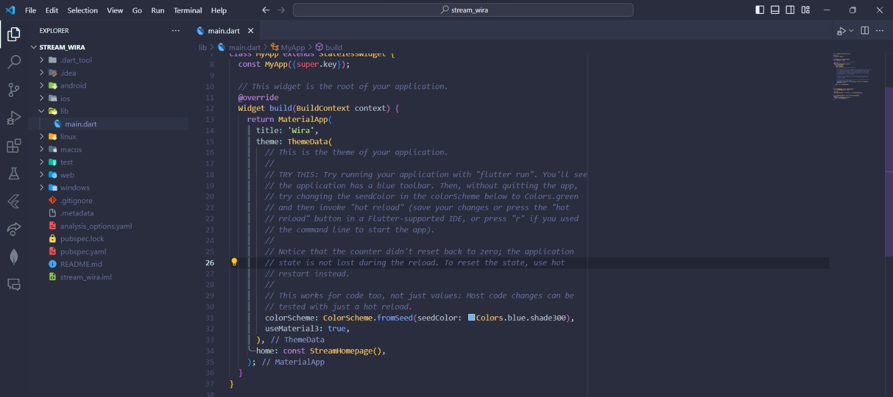
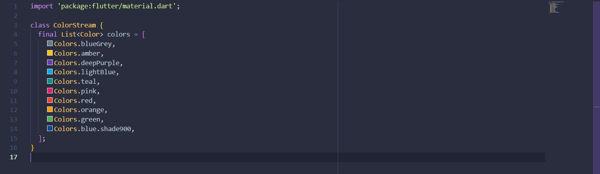
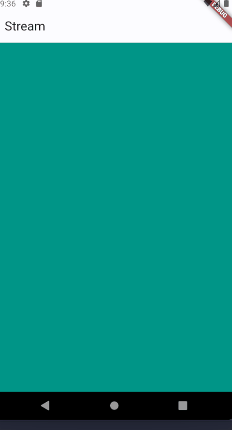
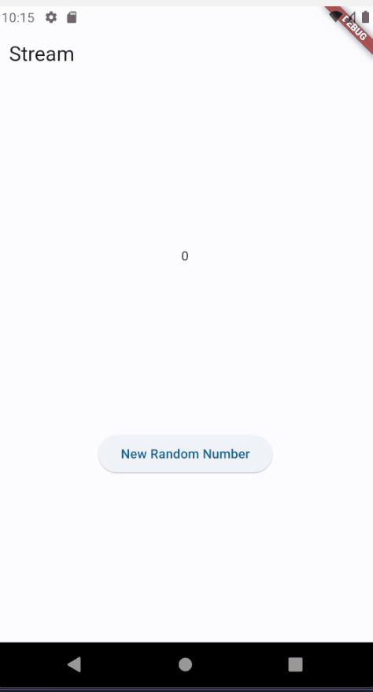
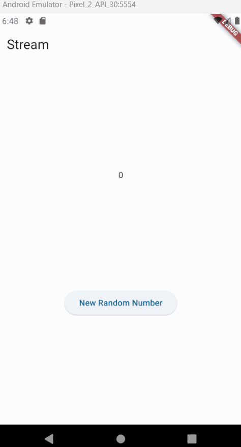
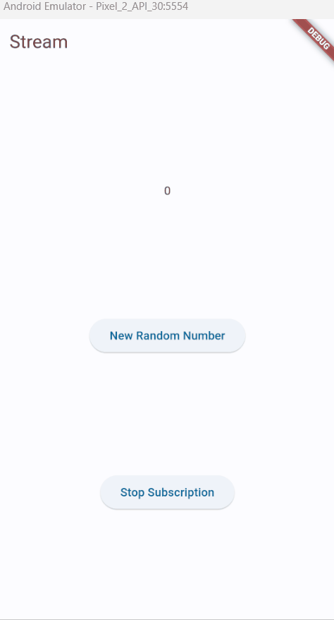
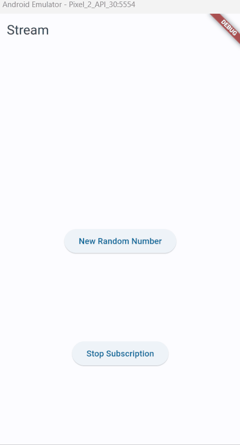
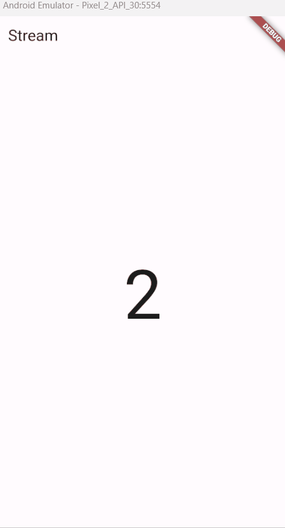
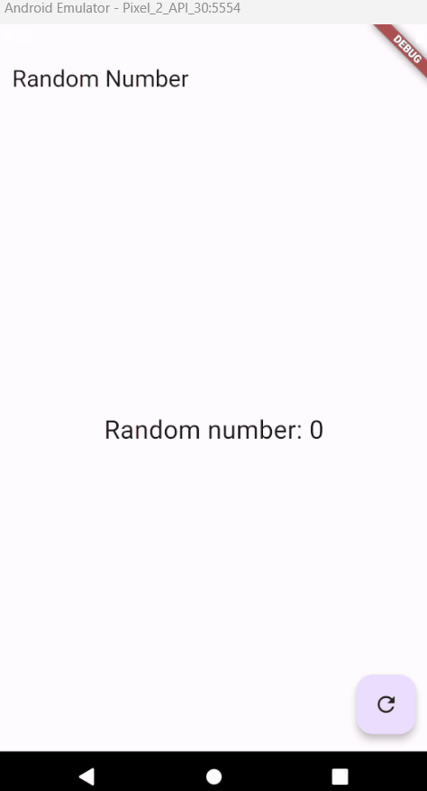

# Praktikum 1: Dart Streams

### Langkah 1: Buat Project Baru

Buatlah sebuah project flutter baru dengan nama stream_nama (beri nama panggilan Anda) di folder week-13/src/ repository GitHub Anda.

### Langkah 2: Buka file main.dart

Ketiklah kode seperti berikut ini.

### Soal 1

- Tambahkan nama panggilan Anda pada title app sebagai identitas hasil pekerjaan Anda.
- Gantilah warna tema aplikasi sesuai kesukaan Anda.
- Lakukan commit hasil jawaban Soal 1 dengan pesan "W13: Jawaban Soal 1"

### Langkah 3: Buat file baru stream.dart

Buat file baru di folder lib project Anda. Lalu isi dengan kode berikut.

### Langkah 4: Tambah variabel colors

Tambahkan variabel di dalam class ColorStream seperti berikut.

### Soal 2

- Tambahkan 5 warna lainnya sesuai keinginan Anda pada variabel colors tersebut.
- Lakukan commit hasil jawaban Soal 2 dengan pesan "W13: Jawaban Soal 2"

### Langkah 5: Tambah method getColors()

Di dalam class ColorStream ketik method seperti kode berikut. Perhatikan tanda bintang di akhir keyword async\* (ini digunakan untuk melakukan Stream data)

### Langkah 6: Tambah perintah yield\*

Tambahkan kode berikut ini.

### Soal 3

- Jelaskan fungsi keyword yield\* pada kode tersebut!
  Jawab:
  Sintaks yield\* digunakan untuk mengembalikan data setiap ada perubahan. Hampir sama dengan sintaks return di Future, namun jika di Future data hanya dikembalikan 1x, di Stream data akan dikembalikan setiap ada perubahan.
- Apa maksud isi perintah kode tersebut?
  Jawab:
  Perintah kode tersebut membuat sebuah function Stream dimana setiap 1 detik sekali akan merubah warna sesuai dengan list warna yang sudah di deklarasikan.
- Lakukan commit hasil jawaban Soal 3 dengan pesan "W13: Jawaban Soal 3"

### Langkah 7: Buka main.dart

Ketik kode impor file ini pada file main.dart

### Langkah 8: Tambah variabel

Ketik dua properti ini di dalam class \_StreamHomePageState

### Langkah 9: Tambah method changeColor()

Tetap di file main, Ketik kode seperti berikut

### Langkah 10: Lakukan override initState()

Ketika kode seperti berikut

### Langkah 11: Ubah isi Scaffold()

Sesuaikan kode seperti berikut.

### Langkah 12: Run

Lakukan running pada aplikasi Flutter Anda, maka akan terlihat berubah warna background setiap detik.

### Soal 4

- Capture hasil praktikum Anda berupa GIF dan lampirkan di README.
- Lakukan commit hasil jawaban Soal 4 dengan pesan "W13: Jawaban Soal 4"

### Langkah 13: Ganti isi method changeColor()

Anda boleh comment atau hapus kode sebelumnya, lalu ketika kode seperti berikut.

### Soal 5

- Jelaskan perbedaan menggunakan listen dan await for (langkah 9) !
  Jawab:
  Listen digunakan untuk memberikan fungsi callback ketika ada perubahan pada stream. Sedangkan await for akan melakukan iterasi setiap nilai yang didapatkan dari stream.
- Lakukan commit hasil jawaban Soal 5 dengan pesan "W13: Jawaban Soal 5"

# Praktikum 2: Stream controllers dan sinks

### Langkah 1: Buka file stream.dart

Lakukan impor dengan mengetik kode ini.

### Langkah 2: Tambah class NumberStream

Tetap di file stream.dart tambah class baru seperti berikut.

### Langkah 3: Tambah StreamController

Di dalam class NumberStream buatlah variabel seperti berikut.

### Langkah 4: Tambah method addNumberToSink

Tetap di class NumberStream buatlah method ini

### Langkah 5: Tambah method close()

### Langkah 6: Buka main.dart

Ketik kode import seperti berikut

### Langkah 7: Tambah variabel

Di dalam class \_StreamHomePageState ketik variabel berikut

### Langkah 8: Edit initState()

### Langkah 9: Edit dispose()

### Langkah 10: Tambah method addRandomNumber()

### Langkah 11: Edit method build()

### Langkah 12: Run

Lakukan running pada aplikasi Flutter Anda, maka akan terlihat seperti gambar berikut.

### Soal 6

- Jelaskan maksud kode langkah 8 dan 10 tersebut!
  Jawab:
  langkah 8 melakukan inisialisasi variable dan juga melakukan listen data pada numberStream.
  langkah 10 melakukan random angka dengan angka maksima 10, kemudian angka tersebut dimasukkan / sink ke dalam numberStream.
- Capture hasil praktikum Anda berupa GIF dan lampirkan di README.
  
- Lalu lakukan commit dengan pesan "W13: Jawaban Soal 6".

### Langkah 13: Buka stream.dart

Tambahkan method berikut ini.

### Langkah 14: Buka main.dart

Tambahkan method onError di dalam class StreamHomePageState pada method listen di fungsi initState() seperti berikut ini.

### Langkah 15: Edit method addRandomNumber()

Lakukan comment pada dua baris kode berikut, lalu ketik kode seperti berikut ini.

### Soal 7

- Jelaskan maksud kode langkah 13 sampai 15 tersebut!
  Jawab:
  langkah 13 sampai 15 mensimulasikan jika terjadi error pada Stream. Fungsi onError akan menghandle stream ketika terjadi error.
- Kembalikan kode seperti semula pada Langkah 15, comment addError() agar Anda dapat melanjutkan ke praktikum 3 berikutnya.
- Lalu lakukan commit dengan pesan "W13: Jawaban Soal 7".

# Praktikum 3: Injeksi data ke streams

### Langkah 1: Buka main.dart

Tambahkan variabel baru di dalam class \_StreamHomePageState

### Langkah 2: Tambahkan kode ini di initState

### Langkah 3: Tetap di initState

Lakukan edit seperti kode berikut

### Langkah 4: Run

Terakhir, run atau tekan F5 untuk melihat hasilnya jika memang belum running. Bisa juga lakukan hot restart jika aplikasi sudah running. Maka hasilnya akan seperti gambar berikut ini. Anda akan melihat tampilan angka dari 0 hingga 90.

### Soal 8

- Jelaskan maksud kode langkah 1-3 tersebut!
  Jawab:
  Langkah 1 - 3 menambahkan StreamTransformer. Fungsi dari StreamTransformer adalah untuk melakukan operasi khusus terhadap data yang melewati Stream. Terdapat state handleData untuk memodifikasi data yang memasuki Stream, handleError untuk menangani Stream yang menghasilkan error, dan handleDone untuk menangani ketika Stream ditutup.
- Capture hasil praktikum Anda berupa GIF dan lampirkan di README.
  
- Lalu lakukan commit dengan pesan "W13: Jawaban Soal 8".

# Praktikum 4: Subscribe ke stream events

### Langkah 1: Tambah variabel

Tambahkan variabel berikut di class \_StreamHomePageState

### Langkah 2: Edit initState()

Edit kode seperti berikut ini.

### Langkah 3: Tetap di initState()

Tambahkan kode berikut ini.

### Langkah 4: Tambah properti onDone()

Tambahkan dibawahnya kode ini setelah onError

### Langkah 5: Tambah method baru

Ketik method ini di dalam class \_StreamHomePageState

### Langkah 6: Pindah ke method dispose()

Jika method dispose() belum ada, Anda dapat mengetiknya dan dibuat override. Ketik kode ini didalamnya.

### Langkah 7: Pindah ke method build()

Tambahkan button kedua dengan isi kode seperti berikut ini.

### Langkah 8: Edit method addRandomNumber()

Edit kode seperti berikut ini.

### Langkah 9: Run

Anda akan melihat dua button seperti gambar berikut.

### Langkah 10: Tekan button ‘Stop Subscription'

Anda akan melihat pesan di Debug Console seperti berikut.

### Soal 9

- Jelaskan maksud kode langkah 2, 6 dan 8 tersebut!
  Jawab:
  Langkah 2 melakukan subscription terhadap numberStream. Langkah 6 melakukan stop subscription terhadap sebuah stream, namun stream masih berjalan. Langkah 8 melakukan pengecekan apakah numberStream berhenti atau tidak, jika belum berhenti maka akan menambahkan random number, namun jika sudah berhenti maka akan mengembalikan nilai -1.
- Capture hasil praktikum Anda berupa GIF dan lampirkan di README.
  
- Lalu lakukan commit dengan pesan "W13: Jawaban Soal 9".

# Praktikum 5: Multiple stream subscriptions

### Langkah 1: Buka file main.dart

Ketik variabel berikut di class \_StreamHomePageState

### Langkah 2: Edit initState()

Ketik kode seperti berikut.

### Langkah 3: Run

Lakukan run maka akan tampil error seperti gambar berikut.

### Soal 10

- Jelaskan mengapa error itu bisa terjadi ?
  Jawab:
  Error ini terjadi karena 2 subscription melakukan listen kepada Stream yang sama, dan stream belum di broadcast.

### Langkah 4: Set broadcast stream

Ketik kode seperti berikut di method initState()

### Langkah 5: Edit method build()

Tambahkan text seperti berikut

### Langkah 6: Run

Tekan button ‘New Random Number' beberapa kali, maka akan tampil teks angka terus bertambah sebanyak dua kali.

### Soal 11

- Jelaskan mengapa hal itu bisa terjadi ?
  Jawab:
  Hal itu bisa terjadi karena 1 Stream dilakukan listen dua kali pada subscription dan subscription2, sehingga angka akan terus bertambah sebanyak 2 kali.
- Capture hasil praktikum Anda berupa GIF dan lampirkan di README.
  
- Lalu lakukan commit dengan pesan "W13: Jawaban Soal 10,11".

# Praktikum 6: StreamBuilder

### Langkah 1: Buat Project Baru

Buatlah sebuah project flutter baru dengan nama streambuilder_nama (beri nama panggilan Anda) di folder week-13/src/ repository GitHub Anda.

### Langkah 2: Buat file baru stream.dart

Ketik kode ini

### Langkah 3: Tetap di file stream.dart

Ketik kode seperti berikut.

### Langkah 4: Edit main.dart

Ketik kode seperti berikut ini.

### Langkah 5: Tambah variabel

Di dalam class \_StreamHomePageState, ketika variabel ini.

### Langkah 6: Edit initState()

Ketik kode seperti berikut.

### Langkah 7: Edit method build()

### Langkah 8: Run

Hasilnya, setiap detik akan tampil angka baru seperti berikut.

### Soal 12

- Jelaskan maksud kode pada langkah 3 dan 7 !
  Jawab:
  Langkah 3 adalah melakukan yield random number kedalam stream setiap 1 detik. Langkah 7 melakukan listen pada numberStream pada tampilan, sehingga tampilan otomatis akan dirender ulang setiap ada data baru.
- Capture hasil praktikum Anda berupa GIF dan lampirkan di README.
  
- Lalu lakukan commit dengan pesan "W13: Jawaban Soal 12".

# Praktikum 7: BLoC Pattern

### Langkah 1: Buat Project baru

Buatlah sebuah project flutter baru dengan nama bloc_random_nama (beri nama panggilan Anda) di folder week-13/src/ repository GitHub Anda. Lalu buat file baru di folder lib dengan nama random_bloc.dart

### Langkah 2: Isi kode random_bloc.dart

Ketik kode impor berikut ini.

### Langkah 3: Buat class RandomNumberBloc()

### Langkah 4: Buat variabel StreamController

Di dalam class RandomNumberBloc() ketik variabel berikut ini

### Langkah 5: Buat constructor

### Langkah 6: Buat method dispose()

### Langkah 7: Edit main.dart

### Langkah 8: Buat file baru random_screen.dart

Di dalam folder lib project Anda, buatlah file baru ini.

### Langkah 9: Lakukan impor material dan random_bloc.dart

Ketik kode ini di file baru random_screen.dart

### Langkah 10: Buat StatefulWidget RandomScreen

Buatlah di dalam file random_screen.dart

### Langkah 11: Buat variabel

Ketik kode ini di dalam class \_RandomScreenState

### Langkah 12: Buat method dispose()

Ketik kode ini di dalam class \_StreamHomePageState

### Langkah 13: Edit method build()

Ketik kode ini di dalam class \_StreamHomePageState

### Soal 13

- Jelaskan maksud praktikum ini ! Dimanakah letak konsep pola BLoC-nya ?
  Jawab:
  Pada praktikum sebelumnya kita melakukan listen stream pada 1 file, pada praktikum ini dipisahkan ke file baru, sehingga kita dapat membedakan antara UI dengan Business Logic aplikasi.
- Capture hasil praktikum Anda berupa GIF dan lampirkan di README.
  
- Lalu lakukan commit dengan pesan "W13: Jawaban Soal 13".
